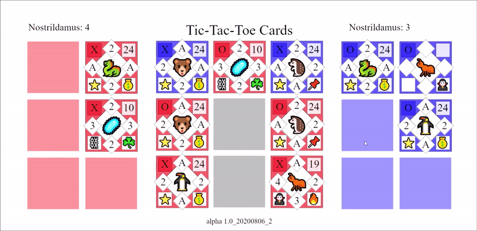

# Triple Triad Emojis the multiplayer card game
A game like "Triple Triad" but with custom cards and abilities, proof of concept (Socket.IO &amp; Node.js).

Play it on Heroku: https://tic-tac-toe-cards.herokuapp.com (*You need a friend to play against.*)

*After building a legal deck and joining a game with a friend, drag cards onto vacant slots to play them.*

An example of a complicated interaction of abilities is the following gif. 

It demonstrates the blue player's penguin 🐧 capturing the left 🐻 and right 🦔 red cards with its bribe ability 💰 and capturing the top card 🦠 with its raw strength (A > 2). At the same time, this triggers the top card's 🦠 chain ability ⛓️ meaning that the top card 🦠 re-uses its ambush ability ☘️ to capture back the played card 🐧. 

In total, after this one interaction, the blue player gains 3 points and the red player gains 1 point.

**Disclaimer**: This is just a simple proof of concept (*minimal working implementation of the idea*), made in a day.
